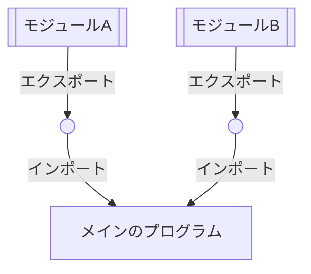
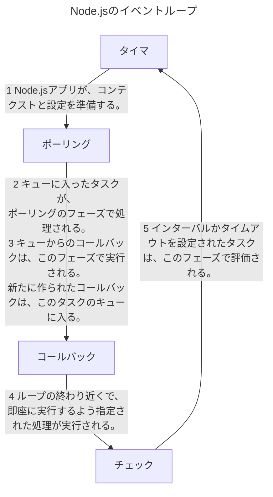

<h1>タイトル: Node.js入門</h1>
  <h2>サブタイトル: </h2>
  <div class="info">2025年12月09日</div>
<br>

<!-- mtoc-start -->

* [1. Node.jsの紹介](#1-nodejsの紹介)
  * [1.1. Node.jsとECMAScript標準](#11-nodejsとecmascript標準)
  * [1.2. Node.jsとWeb標準](#12-nodejsとweb標準)
  * [1.3. Node.jsの特徴](#13-nodejsの特徴)
    * [1.3.1. Node.jsのモジュールシステム](#131-nodejsのモジュールシステム)
    * [1.3.2. CommonJSモジュール](#132-commonjsモジュール)
    * [1.3.3. ESモジュール](#133-esモジュール)
      * [1.3.3.1. 名前付きエクスポート](#1331-名前付きエクスポート)
      * [1.3.3.2. 宣言済み変数をそのままの名前で名前付きエクスポート](#1332-宣言済み変数をそのままの名前で名前付きエクスポート)
      * [1.3.3.3. デフォルトエクスポート](#1333-デフォルトエクスポート)
      * [1.3.3.4. インポートするときのコーディング](#1334-インポートするときのコーディング)
* [2. Node.jsの実行環境の構築](#2-nodejsの実行環境の構築)
  * [2.1. バージョンマネージャの利用](#21-バージョンマネージャの利用)
    * [2.1.1. nvm について](#211-nvm-について)
* [3. Node.js のパッケージ管理ツールの npm について](#3-nodejs-のパッケージ管理ツールの-npm-について)
  * [3.1. JavaScriptの基本](#31-javascriptの基本)
* [4. Webアプリケーションを作成する](#4-webアプリケーションを作成する)
* [5. ユニットテストとデバッグ](#5-ユニットテストとデバッグ)
  * [5.1. ユニットテストツールの分類](#51-ユニットテストツールの分類)
  * [5.2. Mocha + Chai + SinonJS + Istanbul](#52-mocha--chai--sinonjs--istanbul)
  * [5.3. Jest](#53-jest)
  * [5.4. デバッグ](#54-デバッグ)
  * [5.5. まとめ](#55-まとめ)
* [6. 非同期プログラミング](#6-非同期プログラミング)
  * [6.1. イベントループと非同期処理プログラミング](#61-イベントループと非同期処理プログラミング)
    * [6.1.1. マルチスレッドによる並行処理とその問題点](#611-マルチスレッドによる並行処理とその問題点)
    * [6.1.2. イベントループによる並行処理と非同期プログラミング](#612-イベントループによる並行処理と非同期プログラミング)
  * [6.2. コールバック](#62-コールバック)
  * [6.3. Promise](#63-promise)
  * [6.4. ジェネレータ](#64-ジェネレータ)
  * [6.5. async/await](#65-asyncawait)
* [7. EventEmitter とストリーム](#7-eventemitter-とストリーム)
* [8. マルチプロセス、マルチスレッド](#8-マルチプロセスマルチスレッド)
* [9. リアルタイム Web アプリケーション](#9-リアルタイム-web-アプリケーション)
* [10. データストレージ](#10-データストレージ)
* [11. デプロイ](#11-デプロイ)
* [12. JavaScript とコンパイル](#12-javascript-とコンパイル)

<!-- mtoc-end -->


# 1. Node.jsの紹介

このドキュメントには、Node.jsの実行環境および開発環境を構築する手順の記述があります。これらの手順を検証している環境はオペレーションシステムはLinux、LinuxのディストリビューションはLinux mintです。

Node.jsとはオープンソースのJavaScript実行環境です。

このドキュメントは
- Node.jsとECMAScript標準との関係(1.1)
- Node.jsとWeb標準との関係(1.2)
- Node.jsの特徴(1.3)
- Node.jsの実行環境の構築(1.4)
- JavaScriptプログラミングの基礎知識(1.5)

について解説します。

## 1.1. Node.jsとECMAScript標準

JavaScriptの言語仕様はECMAScript標準によって規定されます。これは[ECMA International]という団体に属する技術委員会のTC39(Technical Committee 39)での議論を経て標準化されるものです。[ECMA International]のなかではJavaScriptの言語仕様はECMA-262となっています。

[ECMA International]: https://www.ecma-international.org/

ECMAScript標準のバージョンとリリース時期

| edition | リリース時期 | 通称         | 追加された仕様 |
| ------- | ------------ | ------------ | -------------- |
| 1st     | 1997年6月    | ES(ES1)      |                |
| 2nd     | 1998年6月    | ES2          |                |
| 3rd     | 1999年12月   | ES3          |                |
| 4th     | 破棄         | ES4          |                |
| 5th     | 2009年12月   | ES5          |                |
| 5.1th   | 2011年6月    | ES5.1        |                |
| 6th     | 2015年6月    | ES2015(ES6)  | ESモジュール   |
| 7th     | 2016年6月    | ES2016(ES7)  |                |
| 8th     | 2017年6月    | ES2017(ES8)  |                |
| 9th     | 2018年6月    | ES2018(ES9)  |                |
| 10th    | 2019年6月    | ES2019(ES10) |                |
| 11th    | 2020年6月    | ES2020(ES11) |                |
| 12th    | 2020年6月    | ES2020(ES11) |                |

ESモジュールはECMAScriptモジュールとも呼ばれます。

## 1.2. Node.jsとWeb標準

## 1.3. Node.jsの特徴

### 1.3.1. Node.jsのモジュールシステム

モジュールとは、変数や関数などをまとめたものです。JavaScriptにおいては、1つのモジュールは1つのJavaScriptファイルに対応します。

モジュールは、保守性・名前空間・再利用性のために使われます。

- 保守性: 依存性の高いコードの集合を一箇所にまとめ、それ以外のモジュールへの依存性を減らせます
- 名前空間: モジュールごとに分かれたスコープがあり、グローバルの名前空間を汚染しません
- 再利用性: 変数や関数を複数のプロクラムにコピーせずにモジュールとして再利用できます

モジュールシステムとは、モジュールから変数や関数をインポートして使用できる仕組みのことです。

Node.jsの登場当初(2009年)はECMAScript標準の仕様にはモジュールシステムはありませんでした。そこでNode.jsはCommonJSモジュールと呼ばれるモジュールシステムを導入しました。2015年にECMAScript標準の仕様にESモジュール(ECMAScript Modules)と呼ばれるモジュールシステムが組み込まれ、Node.jsでも利用可能になりました。

つまり2015年以降はNode.jsのモジュールシステムにはCommonJSモジュールとESモジュールが混在する状態になっています。

モジュールシステムのイメージ


### 1.3.2. CommonJSモジュール

CommonJSモジュールは、モジュールレベルのスコープでNode.jsが自動的に割り当てるmoduleという変数のexportsプロパティ(module.exports)を通して、外部に関数や変数を公開します。一方、外部のモジュールをロードする際には同じくモジュールスコープで割 り当てられるrequire()という関数を使います。

例えば与えられた2つの引数を足す関数を作成してadd.cjsというファイルに保存します。このファイルの拡張子はcjsである必要があります。

```javascript:add.cjs
module.exports.add = (a, b) => a + b;
```

この機能を利用するプログラムの拡張子もcjsである必要があります。

```javascript
const math = require('./add.cjs')
math.add(1, 2);
```

### 1.3.3. ESモジュール

#### 1.3.3.1. 名前付きエクスポート

```javascript
// 名前付きエクスポート
export function add(a, b) {
  return a + b;
}
export const subtract = (a, b) => a - b;
```

#### 1.3.3.2. 宣言済み変数をそのままの名前で名前付きエクスポート

```javascript
const multiply = (a, b) => a * b;
export { multiply };
```

#### 1.3.3.3. デフォルトエクスポート

```javascript
export default class Math {
  constructor(value) {
    this.value = value;
  }
  add(value) {
    return new Math(this.value + value);
  }
  substract(value) {
    return new Math(this.value - value);
  }
}
```

#### 1.3.3.4. インポートするときのコーディング

```javascript
import Math, { add, subtract, multiply } from './esm-math.mjs';
import * as math from './esm-math.mjs';

console.log('Math === math.default', Math === math.default);
console.log('add === math.add', add === math.add);
console.log('subtract === math.subtract', subtract === math.subtract);
```

# 2. Node.jsの実行環境の構築


## 2.1. バージョンマネージャの利用

バージョンマネージャは[nvm]を使用します。

[nvm]: https://github.com/nvm-sh/nvm

### 2.1.1. nvm について

# 3. Node.js のパッケージ管理ツールの npm について

Node.jsをインストールするとパッケージ管理ツールであるnpmコマンドもインストールされnpmコマンドを利用することができるようになります。

## 3.1. JavaScriptの基本

# 4. Webアプリケーションを作成する

# 5. ユニットテストとデバッグ

## 5.1. ユニットテストツールの分類

## 5.2. Mocha + Chai + SinonJS + Istanbul

## 5.3. Jest

## 5.4. デバッグ

## 5.5. まとめ

# 6. 非同期プログラミング

Node.js はイベントループにより並行処理を実現しています。プログラマーは並行処理を実現するために非同期プログラミングに対応した記述を習得する必要があります。非同期プログラミングの様々なパターンや、歴史的に非同期プログラミングの記述方法がどのように進化したかを見ます。

## 6.1. イベントループと非同期処理プログラミング


<!-- callback-->Process2 -->

### 6.1.1. マルチスレッドによる並行処理とその問題点

### 6.1.2. イベントループによる並行処理と非同期プログラミング

## 6.2. コールバック

JavaScriptにおける非同期プログラミングの実装パターンの基本的なものはコールバックです。処理Aの処理完了時に処理Bを処理する関数を記述するときには、 その関数に処理Aと処理Bをコールバックとして引数に渡します。

Node.jsのコールバックによる非同期処理の実装には規約があり、fs.readdir()のインターフェースはこの規約に沿ったものとなっています。規約は次の２点からなります。

- コールバックがパラメータの最後にあること
- コールバックの最初のパラメータが処理中に発生したエラー、２つ目以降のパラメータが処理の結果であること

例として、testディレクトリにnew.txtという名前のファイルを作成するプログラムを作成してみましょう。以下が処理フローになります。

- testディレクトリの有無を確認してある場合はnew.txtファイルを作成して、ない場合はtestディレクトリを作成する。
- new.txtファイルの有無を確認して、ある場合はなにもしないでプログラムを終了してない場合はnew.txtファイルを作成する。

## 6.3. Promise

## 6.4. ジェネレータ

## 6.5. async/await

# 7. EventEmitter とストリーム

# 8. マルチプロセス、マルチスレッド

# 9. リアルタイム Web アプリケーション

# 10. データストレージ

# 11. デプロイ

# 12. JavaScript とコンパイル
